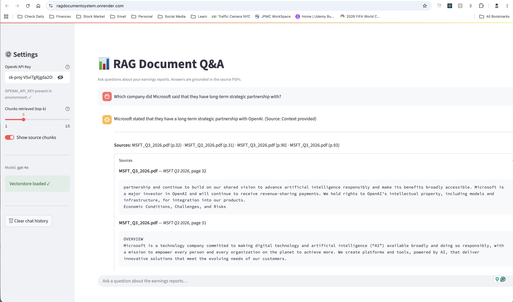

# RAG Document Q&A System

A local **Retrieval-Augmented Generation (RAG)** pipeline that ingests quarterly
earnings reports (PDF) and lets you ask natural language questions about them.
Answers are grounded in the source documents and always include page-level citations.

---

## Architecture

```
┌─────────────────────────────────────────────────────────────────┐
│                        User Query                               │
└───────────────────────────────┬─────────────────────────────────┘
                                │
                                ▼
┌─────────────────────────────────────────────────────────────────┐
│                     qa_chain.py (ask)                           │
│   ┌─────────────────────────┐   ┌───────────────────────────┐  │
│   │  retriever.py           │   │   LLM (OpenAI GPT-4o)     │  │
│   │  FAISS similarity search│──▶│   + System Prompt         │  │
│   │  + metadata filtering   │   │   (financial analyst)     │  │
│   └────────────┬────────────┘   └───────────────────────────┘  │
└────────────────│────────────────────────────────────────────────┘
                 │
                 ▼
┌─────────────────────────────────────────────────────────────────┐
│                   embedder.py (FAISS index)                     │
│   HuggingFace all-MiniLM-L6-v2  ──or──  OpenAI embeddings      │
│   Persisted to  vectorstore/                                     │
└───────────────────────────────┬─────────────────────────────────┘
                                │
                                ▼
┌─────────────────────────────────────────────────────────────────┐
│                   pdf_loader.py                                 │
│   Scans  data/reports/*.pdf                                     │
│   PyMuPDF text extraction  →  chunk (500 chars / 50 overlap)   │
│   Metadata: source, company, quarter, year, page               │
└─────────────────────────────────────────────────────────────────┘
```

---

## Project Structure

```
rag-doc-qa/
├── src/
│   ├── pdf_loader.py     # PDF ingestion & chunking
│   ├── embedder.py       # Embedding model & FAISS index
│   ├── retriever.py      # Similarity search + metadata filtering
│   └── qa_chain.py       # RetrievalQA chain & helpers
├── data/
│   └── reports/          # ← Drop your PDF files here
├── vectorstore/          # Auto-generated FAISS index (gitignored)
├── app.py                # Streamlit browser UI (optional)
├── rag_pipeline.ipynb    # Main walkthrough notebook
├── config.py             # All tunable parameters
├── requirements.txt
├── .env.example
└── README.md
```

---

## Setup

### 1. Clone & create a virtual environment

```bash
git clone <your-repo-url> && cd rag-doc-qa
python -m venv .venv
source .venv/bin/activate        # Windows: .venv\Scripts\activate
```

### 2. Install dependencies

```bash
pip install -r requirements.txt
```

### 3. Configure your API key

```bash
cp .env.example .env
# Edit .env and set your OpenAI key:
# OPENAI_API_KEY=sk-...
```

### 4. Add PDF files

Drop your quarterly earnings PDFs into `data/reports/`.
Follow the naming convention for best results:

```
TICKER_{Q#|FY}_YEAR.pdf
# examples:
AAPL_Q1_2026.pdf
MSFT_Q3_2026.pdf
TSLA_FY_2025.pdf
```

> **Tip:** Run `python3 rename_pdfs.py` (see below) to auto-detect the correct
> period from each PDF's content and rename files automatically.

### 5. Launch the notebook

```bash
source .venv/bin/activate
python -m ipykernel install --user --name rag-doc-qa --display-name "Python (rag-doc-qa)"
jupyter notebook rag_pipeline.ipynb
```

If the notebook opens with a different kernel, select "Python (rag-doc-qa)"
from the kernel picker. Run all cells in order. The FAISS index is built on
first run and cached automatically — subsequent runs load it from
`vectorstore/`.

### 6. (Optional) Launch the Streamlit browser UI

```bash
source .venv/bin/activate
python -m streamlit run app.py
```

Opens a chat interface at **http://localhost:8501**.
The vectorstore must be built first (Step 5 or `build_vectorstore()`).

You can now enter your own OpenAI API key directly in the sidebar. That key is used for the current session only and is more flexible than relying on a single `.env` value.

---

## Docker deployment

A Dockerfile is included so you can run the app in a container with the same paths and dependencies as the local setup.

### Build the image

```bash
docker build -t rag-doc-qa .
```

### Run the container

```bash
docker run --rm -p 8501:8501 \
  -e OPENAI_API_KEY=sk-your-openai-key-here \
  rag-doc-qa
```

If you do not want to pass the key in the command line, you can leave it out and enter it in the sidebar after the app opens.

> The container uses the same repository structure, so the app can find [app.py](app.py), [src](src), [data](data), and [vectorstore](vectorstore) correctly.

---

## Render deployment

Render can deploy this app directly from the included Dockerfile.

### Option 1: Deploy with the Render dashboard

1. Push this repository to GitHub.
2. In Render, create a new Web Service.
3. Choose the GitHub repository and select the Docker environment.
4. Render will automatically use the included Dockerfile.
5. Add an environment variable named `OPENAI_API_KEY` with your OpenAI key, or leave it blank and enter the key in the sidebar after the app is live.
6. Render will start the app on port `8501`.

### Option 2: Deploy with render.yaml

A [render.yaml](render.yaml) file is included for blueprint deployments.

```bash
render blueprint create
```

### Important deployment notes

- The app listens on `0.0.0.0` inside the container so Render can reach it.
- The Streamlit port is set to `8501` and uses the container's `$PORT` when available.
- The vectorstore already included in this repository is used at runtime, so the app can start without rebuilding the index first.
- If you add new PDFs later, rebuild the vectorstore locally or inside a one-off container before redeploying.

---

## Configuration

Edit `config.py` to tune the pipeline:

| Parameter               | Default              | Description                            |
| ----------------------- | -------------------- | -------------------------------------- |
| `CHUNK_SIZE`            | `500`                | Characters per chunk                   |
| `CHUNK_OVERLAP`         | `50`                 | Overlap between consecutive chunks     |
| `TOP_K`                 | `5`                  | Chunks retrieved per query             |
| `LLM_MODEL`             | `"gpt-4o"`           | OpenAI model for generation            |
| `LLM_TEMPERATURE`       | `0.0`                | 0 = deterministic                      |
| `USE_OPENAI_EMBEDDINGS` | `False`              | `True` → OpenAI, `False` → HuggingFace |
| `HF_EMBEDDING_MODEL`    | `"all-MiniLM-L6-v2"` | HuggingFace sentence-transformer model |

---

## Adding New PDFs

1. Copy the new PDF to `data/reports/` using the `TICKER_Q#_YEAR.pdf` format.
2. Delete the existing vectorstore to force re-indexing:
   ```bash
   rm -rf vectorstore/
   ```
3. Re-run the notebook (or call `build_vectorstore()` in `embedder.py`).

---

## Example Queries

```python
from src.qa_chain import build_qa_chain, ask

chain = build_qa_chain()

result = ask("What was Apple's revenue in Q1 2024?", chain)
print(result["answer"])
print(result["source_summary"])
```

More example queries:

- _"Compare the gross margins of Apple and Microsoft in their latest quarters."_
- _"What risks did Tesla mention in their most recent quarterly report?"_
- _"Which company reported the highest net income this quarter?"_
- _"What did the CFO say about guidance for next quarter?"_

---

## Offline Usage

With `USE_OPENAI_EMBEDDINGS = False` (default), the embedding step runs
entirely offline using HuggingFace sentence-transformers.
Only the **answer generation** step requires an internet connection and
OpenAI API key.

---

## Demo screenshots



## Streamlit UI

The optional browser interface (`app.py`) provides:

- **Chat interface** — multi-turn conversation with the document corpus
- **Source viewer** — expandable panel showing the exact chunks used for each answer
- **Top-k slider** — adjust retrieval depth without restarting
- **Vectorstore & API key status** — warnings shown in the sidebar when prerequisites are missing

```bash
streamlit run app.py
```

| Feature       | Detail                                                    |
| ------------- | --------------------------------------------------------- |
| Default port  | `http://localhost:8501`                                   |
| Chain caching | `@st.cache_resource` — loaded once per session            |
| Chat history  | Stored in `st.session_state`, cleared with sidebar button |
| Prerequisites | Vectorstore built + `OPENAI_API_KEY` set in `.env`        |

---

## Security Notes

- API keys are loaded from `.env` via `python-dotenv` — **never hardcode** them.
- `.env` is listed in `.gitignore` and must not be committed.
- The `allow_dangerous_deserialization=True` flag in `embedder.py` is safe
  because the vectorstore is written by this application; do not load
  untrusted FAISS files from external sources.
